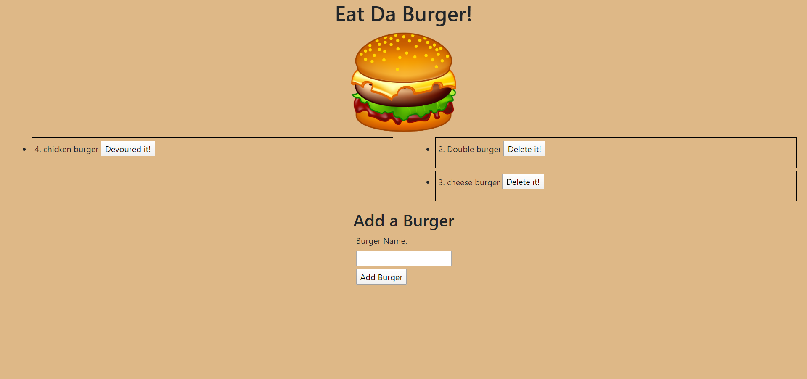

# Eat-Da-Burger

## Overview
Eat-Da-Burger! is a restaurant app that lets users input the names of burgers they'd like to eat. Whenever a user submits a burger's name, your app will display the burger on the left side of the page -- waiting to be devoured.\
Each burger in the waiting area also has a `Devour it!` button. When the user clicks it, the burger will move to the right side of the page with a `Delete it!` button. The app will store every burger in a database, whether devoured or not.


## Getting Started
These instructions will get you a copy of the project up and running on your local machine.

### Installing
Git clone the repository to your local machine:

HTTPS:
```
https://github.com/AmjedAyoub/burger.git
```
SSH:
```
git@github.com:AmjedAyoub/burger.git
```

## Screen-shots

### Home Page


## Technologies & Tools
* HTML  
* CSS
* JavaScript
* MySQL 
* Node
* Express
* Handlebars 
* Homemade ORM, [read more](./config/orm.js) 

## Links
This application is deployed on Heroku, [Try it yourself](https://burger-da-burger.herokuapp.com/).\
This application is published on [GitHub](https://github.com/AmjedAyoub/burger).

## Authors
See contribution history [here](https://github.com/AmjedAyoub/burger/graphs/contributors).